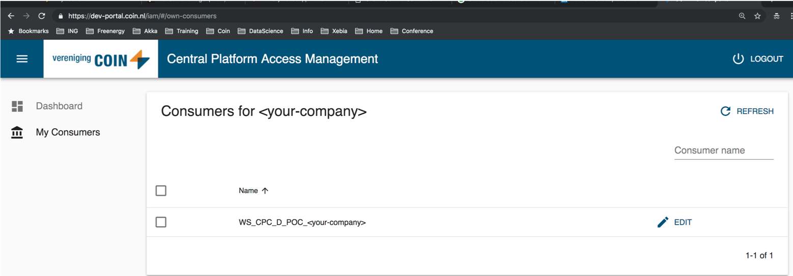
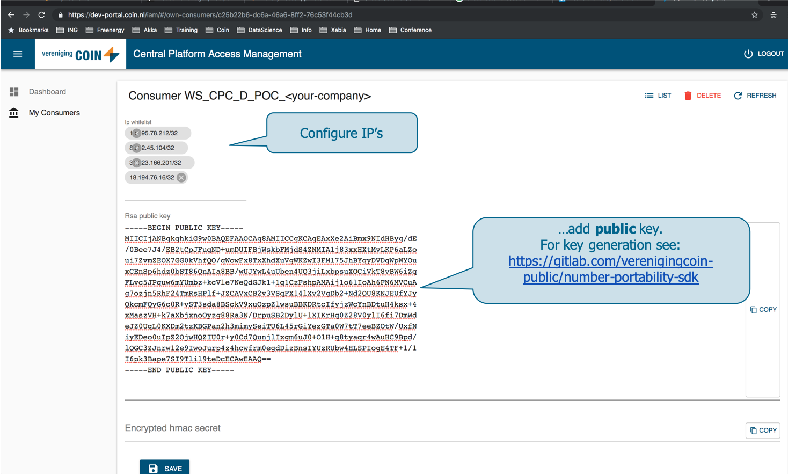
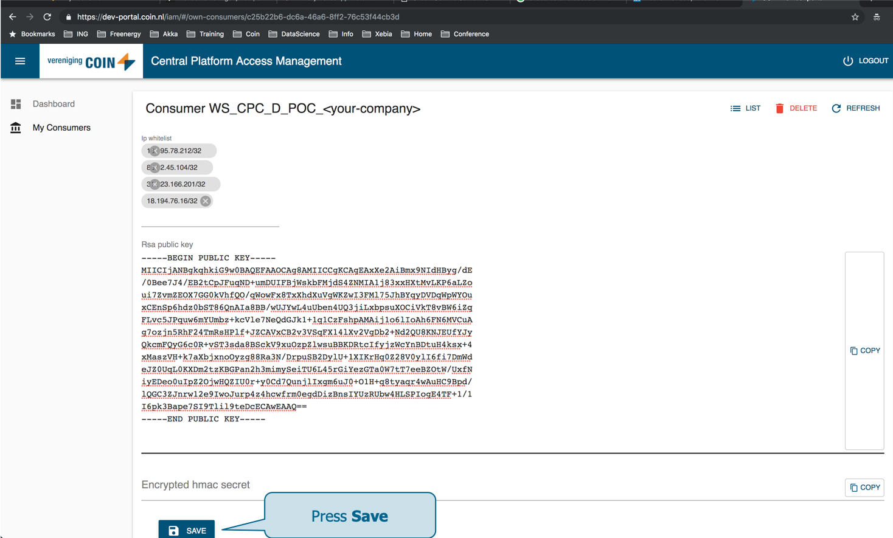
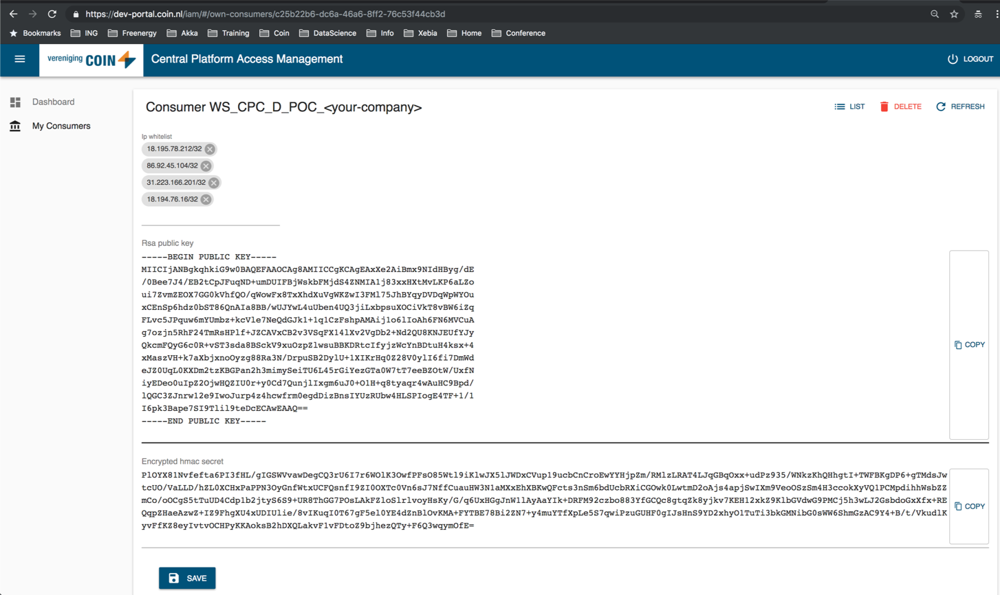

# COIN REST APIs

## Introduction
The COIN RESTful APIs serve as replacements of the outdated MQ and SOAP interfaces.
The new approach comprises highly secure yet quick and easy to implement web-standards without the need for additional middleware for API users. 

Coin offers SDKs in various programming languages to ease access to the new APIs.

For a quick start follow the steps below:
* [Configure Credentials](#cred)
* [Choose an API](#clients)
* [Additional Resources](#resources)
* [Support](#support)


## <a name="cred"></a>Configure Credentials
### <a name="cred"></a>Generate Keys
To access a Coin API a private/public key pair are required. To generate a private/public key pair, type:
```
ssh-keygen -m PEM -t rsa -b 4096 -f private-key.pem -N '' 
ssh-keygen -e -m PKCS8 -f private-key.pem > public-key.pem
```
For windows users please note that running the commands in git-bash is required:
```
ssh-keygen.exe -m PEM -t rsa -b 4096 -f private-key.pem -N ''
ssh-keygen.exe -e -m PKCS8 -f private-key.pem > public-key.pem
```
This script generates two artifacts: `public-key.pem` and `private-key.pem`.

### <a name="cred"></a>Store keys in Coin's IAM
- Go to: https://test-portal.coin.nl/iam#/
    - Access to this site requires a user account that can be requested at [Coin Servicedesk](mailto:servicedesk@coin.nl)


- Select <strong>consumer</strong>


- Configure <strong>IPs</strong> and add <strong>public key</strong>


- Press <strong>save</strong>


- Retrieve Client Credentials
    - Copy the contents of the <i>Encrypted hmac secret</i> field and place it into a file named: `sharedkey.encrypted`.

 
Once the public key is registered the following artifacts are needed to gain secured access to Coin APIs:
- Consumer name (see above)
- `private-key.pem` (see above)
- `sharedkey.encrypted` (encrypted (by public key) HMAC secret) (see above) 
    
## <a name="clients"></a>Choose an API

### <a name="C#client"></a>C# SDKs for the APIs
- The C# SDK documentation for the Number Portability API can be found [here](number-portability-sdk/README.md)

## <a name="resources"></a>Additional Resources

##### COIN APIs
- Swagger-UI: https://test-api.coin.nl/docs
- Swagger-File: https://test-api.coin.nl/docs/number-portability/v1/swagger.json
- API Dashboard: https://test-portal.coin.nl/apis
- General info about accessing Coin APIs: https://gitlab.com/verenigingcoin-public/cpc-client/

## <a name="support"></a>Support
For support mail the [Coin devops team](mailto:devops@coin.nl)
